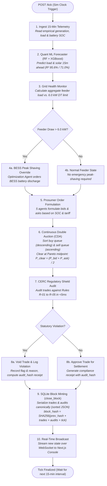
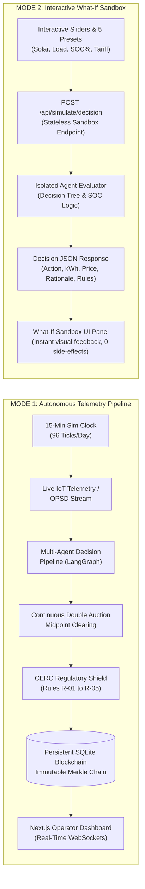

# GridMesh — Decentralized Energy Intelligence Platform
### Autonomous Multi-Agent P2P Microgrid Trading, Predictive Forecasting & Verifiable Settlement

[](https://www.python.org/downloads/)
[](https://fastapi.tiangolo.com)
[](https://nextjs.org)
[](https://langchain-ai.github.io/langgraph/)
[](https://xgboost.readthedocs.io/)
[]()
[](LICENSE)

---

## Executive Summary

**GridMesh** is an industrial-grade, decentralized microgrid intelligence platform designed for peer-to-peer (P2P) clean energy trading, predictive demand balancing, and cryptographic settlement. Built strictly according to the **IEEE 2030.7 Distributed Energy Resource (DER)** microgrid standard and calibrated to the **Central Electricity Regulatory Commission (CERC) Open Access** framework, GridMesh coordinates autonomous software agents that represent residential solar homes, commercial arrays, community battery systems (BESS), and electric vehicle (EV) charging stations.

Every 15 minutes, autonomous software agents predict local solar generation and consumption, negotiate bilateral energy transfers via a Continuous Double Auction, protect physical distribution transformers from thermal overload, enforce statutory regulatory collars, and seal all financial transactions into an immutable SHA-256 Merkle-linked blockchain ledger.

---

## The Core Problem

Conventional distribution grids operate as rigid, centralized, one-way pipelines. As distributed rooftop solar and high-power EV charging surge across Indian urban centers, two systemic failures emerge:

1. **The Prosumer Economic Disparity:**
   State DISCOMs purchase surplus rooftop solar at minimal net-metering buyback rates (**₹2.60/kWh**), while reselling that same energy to adjacent residential neighbors at full peak tariffs (**₹7.80 to ₹8.50/kWh**). Prosumers are disincentivized from expanding solar capacity, while non-solar consumers face escalating monthly utility bills.
2. **Distribution Transformer (DT) Overload & Thermal Burnout:**
   Simultaneous evening residential air conditioning and uncoordinated EV fleet charging cause severe aggregate load spikes. Distribution transformers routinely breach their physical thermal limits (e.g. 6.0 kW per local low-voltage cluster), causing frequent local feeder brownouts, voltage instability, and catastrophic transformer burnouts.
3. **The 15-Minute Human Impossibility:**
   Power systems balance dynamically every 15 minutes (96 operational dispatch intervals per 24-hour day). Expecting human prosumers to log in 96 times a day to manually click "Buy" or "Sell" 0.35 kWh of solar power is physically impossible. **Autonomous multi-agent systems are the only viable technical solution.**

---

## Key Features & Technological Innovations

### 1. Autonomous 15-Minute Dispatch Engine
* Simulates 96 operational intervals per 24-hour day in continuous **12-hour AM/PM Indian Standard Time (IST)**.
* Hands-free autonomous execution: prosumers configure high-level economic preferences once; autonomous software agents manage bidding, matching, and physical battery dispatch 24/7.
* Integrated single-step forward (`+15m`), auto-run (4-second real-time streaming), and clean clock reset endpoints.

### 2. Quant ML Forecaster (Voting Ensemble)
* **Architecture:** Trained `VotingRegressor` ensemble combining regularized **Random Forest** (100 estimators, max depth 12) and **XGBoost** (100 rounds, learning rate 0.08, max depth 5, subsample 0.8).
* **Dataset:** 14,400 empirical observations across 30 days derived from high-resolution smart meter telemetry.
* **Feature Engineering:**
  * Autoregressive lags: `lag1_load` and `lag1_gen` (rolling historical meter memory).
  * Cyclical trigonometric embeddings: $\sin(2\pi \cdot \text{tick}/96)$ and $\cos(2\pi \cdot \text{tick}/96)$ eliminating midnight boundary discontinuities.
  * Temporal & calendar features: `hour`, `minute`, `day_of_week`, `is_weekend`, `tick_of_day`.
  * Node entity one-hot encodings.
* **Evaluation:** Strict temporal out-of-sample split (Days 1–23 train, Days 24–30 test chronologically to prevent lookahead data leakage).
* **Validated Performance:**
  * **Solar Generation:** $R^2 = 95.62\%$, $\text{MAE} = 0.222\text{ kW}$
  * **Demand Load:** $R^2 = 70.98\%$, $\text{MAE} = 0.098\text{ kW}$

### 3. Multi-Agent Intelligence Hierarchy (LangGraph)
A cooperating multi-agent pipeline executing sequentially within each 15-minute dispatch tick:
1. **Forecasting Agent:** Computes 15-minute ahead generation and demand predictions for all microgrid nodes.
2. **Grid Health Agent:** Computes aggregate feeder draw against the distribution transformer safety threshold (6.0 kW).
3. **Optimization Agent:** Detects stress and issues automated BESS battery discharge overrides to shave peak loads before market formation.
4. **Prosumer Agents (×5):** Evaluates net energy balance, battery state-of-charge (SOC %), and natural language preferences to formulate market orders.
5. **Trading Agent:** Aggregates bids and asks and executes a Continuous Double Auction.
6. **Regulation Agent:** Audits proposed trades against CERC grid-code rules prior to ledger entry.

### 4. Continuous Double Auction Market Clearing
* Descending buyer bid queue matched against ascending seller ask queue.
* Pareto-optimal clearing price calculated at the supply-demand midpoint:
  $$P_{\text{clear}} = \frac{P_{\text{bid}} + P_{\text{ask}}}{2}$$
* **Economic Impact:**
  * Benchmark P2P Clearing Rate: **₹6.20/kWh** vs. DISCOM Retail **₹7.80/kWh**.
  * **Consumers Save:** **~20.5% to 22.0%** per unit of electricity purchased.
  * **Prosumers Earn:** **+138%** higher revenue compared to DISCOM net-metering feed-in buyback (₹2.60/kWh).

### 5. CERC Regulatory Compliance Shield
Automated sub-5ms policy enforcement engine auditing every trade against statutory grid rules:
* **Rule R-01 (Price Collar Ceiling):** Rejects any trade cleared above ₹9.00/kWh to eliminate predatory surge pricing.
* **Rule R-02 (Volume Quota Cap):** Limits single transactions to 10.0 kWh per trade to prevent capacity monopolization.
* **Rule R-03 (Self-Trade Guard):** Blocks wash trading where the buyer and seller identities are identical.
* **Rule R-04 (Anti-Collusion Floor):** Flags non-competitive transfers below generation cost (₹4.00/kWh).
* **Rule R-05 (Distribution Transformer Limit):** Halts transactions that would physically push aggregate transformer loading beyond 8.0 kW.

### 6. Verifiable SHA-256 Merkle Blockchain Ledger
Every settled trade and statutory compliance receipt is committed into an immutable, SQLite-backed cryptographic hash chain, guaranteeing auditability, non-repudiation, and sub-millisecond query performance without gas fees or external network dependencies.

* **Two-Tier Cryptographic Architecture:**
  * **Tier 1 — Row-Level Audit Receipts:** For every transaction audit, the compliance engine computes a tamper-evident 16-character SHA-256 cryptographic receipt:
    ```python
    audit_hash = hashlib.sha256(
        f"{tick}|{trade_index}|{flag}|{rationale}".encode()
    ).hexdigest()[:16]
    ```
  * **Tier 2 — Tick-Level Merkle Hash-Chain:** At the end of each 15-minute operational interval, `close_block(tick)` queries all persisted trades and audit rows directly back from the database, applies deterministic canonical JSON serialization (alphabetically sorted keys, compact separators `","` and `":"`), and computes the cryptographic block hash:
    ```python
    block_hash = hashlib.sha256(
        (prev_hash + serialized_trades + serialized_audits + str(tick)).encode()
    ).hexdigest()
    ```
  * **Genesis Block Anchor:** For Block #0 (`tick = 0`), `prev_hash` is anchored to a 64-character zero string (`"0" * 64`). For any subsequent block $t$, `prev_hash` is strictly cryptographically linked to the `block_hash` of block $t-1$.

* **Dual-Validation Chain Integrity Engine (`POST /api/blockchain/verify`):**
  1. **Chain Continuity Check:** Traverses the entire chain to verify that block $t$'s `prev_hash` strictly equals block $t-1$'s `block_hash`.
  2. **Row-Level Recomputation from Ground Truth:** Rather than trusting in-memory state, the verification engine queries raw records from the `trades` and `audits` tables, reconstructs the canonical JSON payloads, and re-computes each block hash from disk.
  * **Zero-Trust Forensic Attribution:** If a malicious actor or corrupted process alters any historical field (e.g., trade quantity, clearing price, or audit clearance flag) directly in the SQLite database, the recomputed hash diverges from the stored block header, instantly flagging the exact compromised block in red (`status: "tampered"`) with zero downtime.

### 7. Interactive What-If Decision Sandbox
* A dedicated evaluation sandbox enabling operators and evaluators to manually test agent decision-making under custom boundary conditions without altering the main 15-minute simulation clock or blockchain ledger.
* **Live Parameters:** Solar PV Generation (0–12 kW), Demand Load (0–12 kW), Battery SOC (0–100%), P2P Price (₹3–13/kWh), and Feeder Threshold.
* **5 Quick-Select Presets:**
  * *Noon Solar Export:* High solar (6.8 kW) + full battery (92%) $\rightarrow$ Action: `SELL 1.40 kWh` P2P Ask.
  * *Battery Self-Storage:* Solar surplus (4.5 kW) with low battery (35% SOC) $\rightarrow$ Action: `CHARGE 0.88 kWh` (self-consumption prioritized).
  * *Evening Deficit:* Zero solar + high load (3.6 kW) $\rightarrow$ Action: `BUY 0.90 kWh` P2P Bid.
  * *Feeder Overload (BESS):* Surge load exceeds 6.0 kW $\rightarrow$ Triggers automated BESS peak-shaving override.
  * *CERC Price Collar Spike:* Price at ₹11.50/kWh $\rightarrow$ CERC Regulatory Guard flags Rule R-01 violation, blocking trade.

### 8. Indian Feeder Calibration & Environmental Baseline
* Calibrated to Indian tropical Global Horizontal Irradiance (5.5–6.5 kWh/m²/day) with IST midday solar peak (11:30–13:30).
* Scaled to Indian distribution feeder dynamics: commercial afternoon cooling loads and pronounced evening domestic surges (18:00–22:00 IST).
* Decarbonization quantified using the **Central Electricity Authority (CEA) Baseline Database v19** emission factor: **0.716 kg CO₂/kWh** avoided per unit of local renewable power traded.

---

## System Architecture

GridMesh employs an 8-layer modular architecture structured according to the **IEEE 2030.7 Microgrid Standard**, separating physical data telemetry, predictive machine learning, multi-agent negotiation, statutory policy enforcement, cryptographic persistence, and operator interfaces.

### 1. End-to-End Layered System Architecture

```mermaid
flowchart TD
    subgraph L0 ["LAYER 0: Physical IoT & Edge Layer"]
        METER["Smart Meters<br/><b>DLMS / COSEM</b> (IS 16444)"]
        INVERT["Solar PV Inverters<br/><b>Modbus RTU / TCP</b> (SunSpec)"]
        BMS["Battery BMS<br/><b>CAN bus / RS-485</b>"]
        GATEWAY["Industrial IoT Edge Gateway<br/>(Raspberry Pi CM4 / ESP32-S3)<br/><i>Zero Manual Uploads</i>"]
        
        METER -->|"Bidirectional kWh Telemetry"| GATEWAY
        INVERT -->|"Real-Time Generation & MPPT"| GATEWAY
        BMS -->|"Battery SOC% & Thermal State"| GATEWAY
    end

    subgraph L1 ["LAYER 1: Ingestion & Feeder Adaptation"]
        INGEST["Empirical Telemetry Ingestion<br/>14,400 OPSD Smart Meter Records (15-min)"]
        CALIB["Indian Feeder Calibration Engine<br/>• GHI: 5.5–6.5 kWh/m²/day<br/>• IST Solar Peak: 11:30–13:30<br/>• Evening Cooling Surge: 18:00–22:00<br/>• CEA Baseline: 0.716 kg CO₂/kWh"]
        
        GATEWAY -->|"MQTT over TLS"| INGEST
        INGEST --> CALIB
    end

    subgraph L2 ["LAYER 2: Quant ML Predictive Core"]
        FEAT["Feature Engineering Pipeline<br/>• Autoregressive Lags (lag1_load, lag1_gen)<br/>• Cyclical sin/cos Time Embeddings<br/>• Temporal & Calendar Features"]
        MODEL["Voting Ensemble Forecaster<br/>• Random Forest (100 trees, depth 12)<br/>• XGBoost (100 rounds, lr 0.08)<br/><b>Solar R² = 95.62% | Demand R² = 70.98%</b>"]
        
        CALIB --> FEAT
        FEAT --> MODEL
    end

    subgraph L3 ["LAYER 3: Multi-Agent Intelligence Engine (LangGraph)"]
        FA["Forecasting Agent<br/>Serves 15-min ahead net forecasts"]
        GHA["Grid Health Agent<br/>Monitors 6.0 kW DT Feeder Safety Limit"]
        OPT["Optimization Agent<br/>Schedules BESS Peak-Shaving Discharge"]
        PA["5 Prosumer Trading Agents<br/>• Solar Home A (Prosumer)<br/>• Residential Cluster B (Consumer)<br/>• Commercial Solar C (Exporter)<br/>• EV Fleet Hub D (Flexible Load)<br/>• Community BESS E (Buffer)"]
        
        MODEL --> FA
        FA --> GHA
        GHA -->|"Transformer Stress Flag"| OPT
        OPT -->|"BESS Discharge Override"| PA
        FA -->|"Forecast Net Deficit/Surplus"| PA
    end

    subgraph L4 ["LAYER 4: Continuous Double Auction (CDA)"]
        BOOK["Orderbook Aggregation<br/>Descending Bids vs. Ascending Asks"]
        CLEAR["Pareto Midpoint Clearing Engine<br/>P_clear = (P_bid + P_ask) / 2<br/><b>₹6.20/kWh Avg (vs. DISCOM ₹7.80/kWh)</b>"]
        
        PA -->|"Submit Bids & Asks"| BOOK
        BOOK --> CLEAR
    end

    subgraph L5 ["LAYER 5: CERC Regulatory Compliance Shield"]
        RULES["Statutory Policy Verification Engine (Sub-5ms)<br/>• R-01: Price Collar Ceiling (max ₹9.00/kWh)<br/>• R-02: Volume Quota Cap (max 10.0 kWh)<br/>• R-03: Self-Trade Guard (Wash Trading)<br/>• R-04: Anti-Collusion Floor (min ₹4.00/kWh)<br/>• R-05: Transformer Saturation Limit (8.0 kW)"]
        AUDIT["Row-Level Tamper-Evident Receipts<br/>audit_hash = SHA256(tick|trade_idx|flag|rationale)[:16]"]
        
        CLEAR -->|"Proposed Trades"| RULES
        RULES -->|"Audit Validation"| AUDIT
    end

    subgraph L6 ["LAYER 6: Verifiable Settlement Ledger"]
        CANON["Deterministic Canonical JSON Serialization<br/>(sorted keys, compact separators)"]
        CHAIN["SQLite SHA-256 Merkle Hash-Chain<br/>block_hash = SHA256(prev_hash + trades + audits + tick)<br/>• Genesis: prev_hash = 64 zeros<br/>• Dual-Validation Chain Integrity Engine"]
        
        AUDIT --> CANON
        CANON --> CHAIN
    end

    subgraph L7L8 ["LAYERS 7 & 8: Presentation & Simulation"]
        UI["Next.js 16 Operator Dashboard (Layer 8)<br/>• Live SVG Synoptic Diagram & Current Flows<br/>• Continuous Orderbook Depth & Ticker<br/>• Interactive Chain Explorer & Tamper UI"]
        SANDBOX["What-If Decision Sandbox (Layer 7)<br/>• Stateless Parameter Injection (POST /api/simulate/decision)<br/>• 5 Presets & Live Dynamic Sliders<br/>• Zero Ledger / Blockchain Mutation"]
        
        CHAIN -->|"WebSocket Telemetry Stream"| UI
        CHAIN -.->|"Stateless Baseline Context"| SANDBOX
    end
```



---

### 2. 15-Minute Operational Dispatch State Machine

The following flowchart details the sequential execution pipeline invoked at every 15-minute dispatch interval ($t \rightarrow t+1$):



---

### 3. Dual Execution Modes: Autonomous Engine vs. What-If Sandbox



---

### 4. Architectural Layers Specification Matrix

| Layer # | Layer Name | Core Technologies & Protocols | Input Signals | Primary Outputs & Artifacts | Target SLA |
| :--- | :--- | :--- | :--- | :--- | :--- |
| **Layer 0** | **Physical IoT Edge** | DLMS/COSEM (IS 16444), Modbus RTU, CAN bus, Raspberry Pi CM4 / ESP32-S3 | Bidirectional smart meters, solar MPPT, battery BMS | Normalized JSON telemetry payloads over MQTT/TLS | Sub-1s edge polling |
| **Layer 1** | **Ingestion & Calibration** | Python 3.14, OPSD Dataset, CEA Baseline Database v19 | 14,400 empirical 15-minute observations, Indian GHI data | Calibrated diurnal profile (IST 11:30–13:30 solar peak, 18:00–22:00 cooling surge) | <10ms interval ingestion |
| **Layer 2** | **Quant ML Forecaster** | scikit-learn (`VotingRegressor`), XGBoost, NumPy | Autoregressive lags (`lag1_load`, `lag1_gen`), cyclical sin/cos embeddings | 15-min ahead load & solar predictions ($R^2 = 95.62\%$ solar, $70.98\%$ demand) | <50ms inference |
| **Layer 3** | **Multi-Agent Intelligence** | LangGraph, Python Multi-Agent Coordinator | Predicted loads, battery SOC %, 6.0 kW feeder safety limit | Optimized BESS dispatch overrides & 5 prosumer bid/ask order intents | <150ms agent consensus |
| **Layer 4** | **Double Auction Clearing** | Continuous Double Auction (CDA), Pareto Midpoint Pricing | Aggregated bid queue (buyers) and ask queue (sellers) | Matched trades at $P_{\text{clear}} = \frac{P_{\text{bid}} + P_{\text{ask}}}{2}$ (avg ₹6.20/kWh) | <10ms queue matching |
| **Layer 5** | **Regulatory Compliance Shield** | CERC/SERC Open Access Policy Engine | Proposed trade candidates & aggregate transformer load | Pass/Fail audit records, voided rogue orders, row-level `audit_hash` | <5ms statutory audit |
| **Layer 6** | **Verifiable Settlement Ledger** | SQLite in WAL Mode, SHA-256 Merkle Hash-Chain | Canonical JSON trades, compliance receipts, preceding `prev_hash` | Immutable block headers in `blocks` table, tamper verification engine | <20ms block minting |
| **Layer 7** | **What-If Decision Sandbox** | FastAPI Stateless Endpoint (`POST /api/simulate/decision`) | Operator custom slider values (Solar, Load, SOC%, Tariff) or 5 quick presets | Dynamic action badges, natural language rationale, order emission (zero ledger mutation) | <50ms evaluation |
| **Layer 8** | **Executive Operator Console** | Next.js 16 (Turbopack), React 19, SVG Synoptic Topology, CSS Tokens | Real-time WebSocket feed (`/ws`), REST API endpoints | Live microgrid visualizer, orderbook depth, blockchain explorer, tamper detection UI | <100ms render cycle |

---

## Production Telemetry Pipeline (Zero Manual Uploads)

A common misconception is that prosumers manually upload spreadsheets or click buttons every 15 minutes. In an industrial microgrid, data acquisition is **100% autonomous**:

1. **The On-Premise IoT Edge Gateway:** Each participant facility has a compact industrial controller (e.g. Raspberry Pi CM4 or ESP32-S3 edge node) installed beside the main electrical panel.
2. **Standard Industrial Protocols:**
   * **Smart Meters:** Communicates bidirectional kWh imports and exports via **DLMS / COSEM (IS 16444 / IS 15959)** over cellular 4G/NB-IoT.
   * **Rooftop Solar Inverters:** Queries generation and MPPT power via **Modbus RTU / Modbus TCP** (SunSpec standard across SolarEdge, Sungrow, Enphase, Havells).
   * **Battery Management Systems (BMS):** Reads state-of-charge (SOC %) and thermal limits via **CAN bus / RS-485**.
3. **Automated 15-Minute Streaming:** At each interval boundary, the gateway securely packages readings and streams them via **MQTT over TLS** to the agent cluster.
4. **Prosumer Experience:** Prosumers configure their economic policy **once** on their smartphone (e.g. *"Keep 30% battery reserve; sell surplus when battery > 80%"*). The software agents handle all 96 daily dispatch cycles automatically.

---

## Microgrid Participant Personas

| Node ID | Entity Name | Type | Assets | Battery Reserve Policy |
| :--- | :--- | :--- | :--- | :--- |
| `solar_home` | Solar Home A | Prosumer | 5.0 kW Solar PV, 8 kWh BESS | Keep 30% reserve; sell surplus when SOC > 80% |
| `household` | Residential Cluster B | Pure Consumer | Baseload & AC Cooling, 4 kWh BESS | Pure consumer; buy P2P power to avoid DISCOM peak |
| `commercial` | Commercial Solar C | Large Prosumer | 15.0 kW Solar Array, 14 kWh BESS | Maximize export revenue during daylight business hours |
| `ev_station` | EV Charging Hub D | Fleet Consumer | Fast DC Chargers, 30 kWh Buffer | Flexible fleet charging; throttles during feeder stress |
| `battery_site` | Community BESS E | Storage Node | 10 kWh Community Storage | Absorbs midday solar overgeneration; discharges during peak |

---

## Repository Structure

```
Gridmesh/
├── backend/                        # FastAPI Multi-Agent Backend
│   ├── app/
│   │   ├── agents/                 # LangGraph Multi-Agent Pipeline
│   │   │   ├── forecasting.py      # Ensemble ML Forecaster (RF + XGBoost)
│   │   │   ├── grid_health.py      # Feeder Stress & Transformer Capacity Monitor
│   │   │   ├── optimization.py     # BESS Peak Shaving & Load Shifting
│   │   │   ├── prosumer.py         # 5 Prosumer Trading Agents (Rule/LLM Tiers)
│   │   │   ├── trading.py          # Continuous Double Auction Market Clearing
│   │   │   ├── regulation.py       # CERC/SERC Compliance Engine (Rules R-01–R-05)
│   │   │   └── graph.py            # LangGraph Pipeline Coordinator
│   │   ├── api/
│   │   │   ├── routes/             # REST Endpoints
│   │   │   │   ├── ticks.py        # POST /tick, POST /tick/reset (Sim Clock)
│   │   │   │   ├── simulate.py     # POST /api/simulate/decision (What-If Sandbox)
│   │   │   │   ├── quant.py        # GET /api/quant/status (Model Health)
│   │   │   │   ├── blockchain.py   # GET /chain, POST /verify, POST /tamper
│   │   │   │   ├── scenarios.py    # POST /api/scenario/rogue_bid (CERC Violations)
│   │   │   │   ├── reports.py      # GET /api/reports (Sustainability & Savings)
│   │   │   │   └── trades.py       # GET /trades (Live & Historic Ticker)
│   │   │   ├── violation_log.py    # Live Statutory Audit Log
│   │   │   └── websockets.py       # Real-Time WebSocket Telemetry Stream
│   │   ├── core/                   # Schemas, SimClock, Config
│   │   ├── data/                   # OPSD Data Loaders & Replay Engines
│   │   ├── ledger/                 # SQLite SHA-256 Merkle Blockchain
│   │   └── llm/                    # Groq Cloud / NVIDIA NIM Client with Fallback
│   ├── tests/                      # Automated Test Suite (60 Passing Tests)
│   │   ├── test_simulate.py        # What-If Decision Sandbox Tests
│   │   ├── test_forecasting.py     # ML Forecast Evaluation Tests
│   │   ├── test_regulation.py      # CERC R-01–R-05 Compliance Tests
│   │   ├── test_sqlite_ledger.py   # SHA-256 Hash Chain & Tamper Tests
│   │   ├── test_clearing.py        # Double Auction Midpoint Tests
│   │   ├── test_optimization.py    # BESS Peak-Shaving Dispatch Tests
│   │   ├── test_prosumer_battery.py# Battery Reserve & SOC Priority Tests
│   │   ├── test_clock.py           # 15-Minute Clock Tests
│   │   └── test_tick.py            # End-to-End Tick Pipeline Tests
│   └── main.py                     # FastAPI Application Entrypoint
│
├── frontend/                       # Next.js 16 (Turbopack) Operator Dashboard
│   ├── app/
│   │   ├── layout.tsx              # Root Layout
│   │   ├── page.tsx                # Tab Orchestrator & KPI State Management
│   │   └── globals.css             # Base Tokens
│   ├── components/
│   │   ├── Header.tsx              # Executive 2-Tier Card with 7 Symmetrical Tabs
│   │   ├── SynopticPanel.tsx       # Live SVG Feeder Topology with Current Flows
│   │   ├── OrderbookPanel.tsx      # Double Auction Bid/Ask Queues & Cleared Trades
│   │   ├── AgentStreamPanel.tsx    # Live Agent Reasoning & Natural Language Log
│   │   ├── BlockchainBanner.tsx    # Cryptographic Chain Explorer & Tamper UI
│   │   ├── QuantPanel.tsx          # ML Model Specs, R² Metrics & Variance Table
│   │   ├── WhatIfSimulator.tsx     # Interactive Parameter Sandbox (Sliders & 5 Presets)
│   │   ├── CompliancePanel.tsx     # CERC Rules Directory & Tamper Audit Matrix
│   │   ├── SystemDesignFlowchart.tsx # 8-Layer Interactive System Architecture
│   │   ├── PlatformGuide.tsx       # Operator Guide, IoT Architecture FAQ & Specs
│   │   ├── DatasetCalibrationBanner.tsx # Indian Feeder Conversion Matrix
│   │   ├── ScenarioBar.tsx         # Rogue Bid Injection Suite
│   │   └── dashboard.css           # 1280px Constant-Width Responsive Design System
│   └── lib/                        # API Client, IST AM/PM Time Formatters, Utils
│
├── data/                           # Data Assets & Training Pipelines
│   ├── train_forecaster.py         # XGBoost + Random Forest Training Script
│   ├── forecaster_ensemble.pkl     # Trained Ensemble Model Bundle (15.9 MB)
│   ├── household_multi_day.csv     # 14,400 Clean 15-Minute Microgrid Observations
│   ├── household_15min.csv         # 480-Row Demonstration Day Slice
│   └── fallbacks/                  # Offline Heuristic JSON Fallbacks
│
├── explanation.txt                 # 2.5-Minute Video Pitch & Director's Screenplay
├── pyproject.toml                  # Python Dependencies Managed via uv
└── .env.example                    # Environment Template
```

---

## Getting Started

### Prerequisites
* **Python:** 3.11+ (Python 3.14 fully supported)
* **Package Manager:** `uv` ([Install uv](https://docs.astral.sh/uv/getting-started/installation/))
* **Node.js:** v18.0+ & `npm`

### 1. Backend Setup
```powershell
# Navigate to repository root
cd Gridmesh

# Sync virtual environment and install dependencies
uv sync --extra dev

# Launch backend API server on port 8000
uv run uvicorn app.main:app --host 127.0.0.1 --port 8000 --reload --app-dir backend
```
The backend will be live at `http://127.0.0.1:8000`. API documentation is available at `http://127.0.0.1:8000/docs`.

### 2. Frontend Setup
In a separate terminal:
```powershell
# Navigate to frontend directory
cd Gridmesh/frontend

# Install dependencies
npm install

# Start Next.js development server
npm run dev
```
Open your browser and navigate to **`http://localhost:3000`**.

### 3. Environment Configuration (Optional)
Copy `.env.example` to `.env`:
```powershell
cp .env.example .env
```
GridMesh includes offline heuristics and fallback models in `data/fallbacks/`, meaning **no external API keys are required to run the platform**. If you wish to use live cloud LLM reasoning, configure your free **Groq Cloud** key in `.env`:
```bash
GROQ_API_KEY=gsk_your_groq_key_here
GROQ_MODEL=qwen/qwen3.8-27b
LLM_PROVIDER=groq
```

---

## API Reference

| Method | Endpoint | Description |
| :--- | :--- | :--- |
| `POST` | `/tick` | Advances the 15-min clock, executes LangGraph multi-agent pipeline, and mints a block. |
| `POST` | `/tick/reset` | Resets the simulation clock back to Step #0 (12:00 AM IST Day 1). |
| `GET` | `/trades` | Returns all historic cleared trades from the SQLite ledger. |
| `GET` | `/api/reports` | Returns community sustainability metrics (kWh traded, savings ₹, CO₂ avoided). |
| `GET` | `/api/quant/status` | Returns ML forecaster health, loaded model path, and fallback status. |
| `POST` | `/api/simulate/decision` | **What-If Sandbox:** Statelessly computes agent decision for custom inputs. |
| `GET` | `/api/blockchain/chain` | Retrieves the full SHA-256 Merkle block history. |
| `POST` | `/api/blockchain/verify` | Cryptographically verifies hash pointers across the entire chain. |
| `POST` | `/api/blockchain/tamper` | Simulates an adversarial database attack by modifying trade volume. |
| `POST` | `/api/scenario/rogue_bid` | Injects illegal bids to trigger CERC rules (R-01 to R-05). |

---

## Automated Verification & Test Suite

GridMesh includes an automated test suite verifying every component from battery SOC thresholds to double-auction clearing and cryptographic hash integrity:

```powershell
# Run the complete test suite
uv run pytest
```

### Test Suite Results:
```
============================= test session starts =============================
platform win32 -- Python 3.14.4, pytest-9.1.1, pluggy-1.6.0
collected 60 items

tests/test_clearing.py .                                                 [  1%]
tests/test_clock.py .                                                    [  3%]
tests/test_forecasting.py ...                                            [  8%]
tests/test_ledger.py .                                                   [ 10%]
tests/test_optimization.py ............                                  [ 30%]
tests/test_prosumer_battery.py ............                              [ 50%]
tests/test_regulation.py ...............                                 [ 75%]
tests/test_simulate.py .....                                             [ 83%]
tests/test_sqlite_ledger.py .........                                    [ 98%]
tests/test_tick.py .                                                     [100%]

======================== 60 passed, 1 warning in 7.26s ========================
```

### Frontend Production Build Gate:
```powershell
cd frontend
npm run build
```
* **Status:** Clean production compilation (`exit code 0`, 0 errors, static prerender validated).

---

## 2.5-Minute Video Pitch & Walkthrough

A shot-by-shot video screenplay with exact timing markers, screen actions, and word-for-word voiceover script is available in:
* [`explanation.txt`](file:///c:/Users/rohit/OneDrive/Desktop/bitnbuild/Gridmesh/explanation.txt)

---

## Standards & Regulatory Grounding

* **IEEE 2030.7-2017:** IEEE Standard for the Specification of Microgrid Controllers.
* **CERC (Open Access in Inter-State Transmission) Regulations:** Framework for non-discriminatory bilateral clean energy access.
* **IS 16444 / IS 15959:** Bureau of Indian Standards (BIS) specifications for AC Static Direct Connected Smart Electricity Meters.
* **CEA India CO₂ Baseline Database v19:** Central Electricity Authority standard emission factor ($0.716\text{ kg CO}_2/\text{kWh}$).
* **Open Power System Data (OPSD):** Empirical 15-minute prosumer smart meter observations.

---

## License

This project is licensed under the MIT License — see the [LICENSE](LICENSE) file for details.
